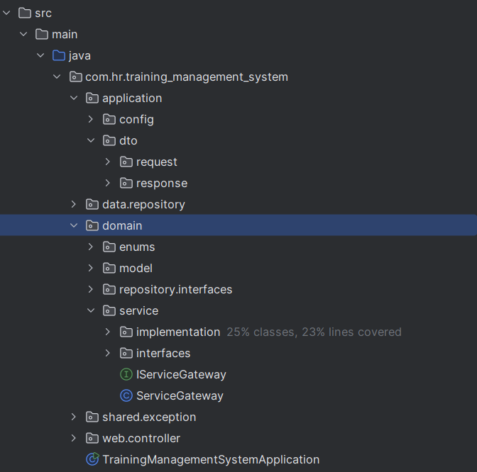

# Training Management System

Olá e bem-vindos.
Esse é um sistema de gestão de treinamentos corporativos, foi desenvolvido em Spring Boot + Docker + MySQL, como parte de um desafio
técnico em Java.

## 🚀 Descrição do Projeto
Este sistema foi projetado especialmente para um desafio ténico, porém uma versão mais robusta pode vir a surgir. Nesse projeto fornecemos uma solução que abrange desde o cadastro de treinamentos até a alocação de funcionários.
A arquitetura foi planejada para ser escalável e de fácil manutençã
DD), além de permitir evolui-la para uma estrutura de microsserviços quando necessário.

Há muito espaço para melhoria, algumas que pensei:
- Inclusão de interface para gestão das demais I{...}Repository (semelhante à unitOfWork do .Net)
- Inclusão de retornos personalizados com os erros (implementado apenas o LOG)
- Inclusão de paginação

Porém, nesses pontos por conta do prazo, optei por focar no que estava sendo solicitado na descrição.

## 🏗️ Arquitetura do Projeto
A arquitetura foi dividida em 5 camadas principais, cada uma com responsabilidades bem definidas, visando uma estrutura organizada e fácil de manter:
- Application (centralizando DTOs e Configs mais globais da aplicação)
- Domain (centralizando regras de negócio, entidades e interfaces necessárias)
- Data (Camada para acesso ao banco de dados)
- Web (Nossa camada de apresentação contendo as controllers)
- Shared (Camada mais geral, que pode vir a ser utilizada nas demais camdas)




### 📌 Princípios Adotados
1. **Separação de Camadas**
    - `controller`: Gerencia protocolo HTTP
    - `domain.service`: Centraliza regras de negócio
    - `data.repository`: Isola acesso a dados

2. **Domain-Driven Design (DDD)**
    - Domínio rico no pacote `domain`
    - Entidades anêmicas em `model`

3. **Inversão de Dependência**
    - Interfaces em `repository.interfaces`
    - Implementações em `data.repository`
    - 
---
### Por que utilizar a estrutura?
A escolha dessa arquitetura está fortemente influenciada pela minha experiência em migrações de 
sistemas (de monolito para microsserviços). Durante esse processo, percebi como a separação 
de responsabilidades facilitou a adição de novas funcionalidades e a manutenção do sistema. 
Além disso, ela aumentou significativamente a velocidade de desenvolvimento, o que é uma 
vantagem que quis trazer para este projeto.
<br><br>
Abaixo deixo listado alguns pontos que acredito que façam a diferença e monstram um ganho na implementação de separações como essa:
<br>**Testes**
- Domínio testável sem dependências externas
- Mocks fáceis via interfaces

<br>**Desenvolvimento seguindo S.O.L.I.D**
- Single Responsibility em cada componente
- inversão de dependencia

---

## 🐳 Execução com Docker
Para simplificar o processo de execução e garantir que o ambiente de desenvolvimento seja consistente, utilizamos Docker para orquestrar os containers. Isso facilita tanto para desenvolvedores (como a criação de um banco de dados local) quanto para usuários que precisam rodar o sistema.
### Passos para rodar:
1. Instale o docker:
   -  Você pode instalar o software <a href="https://www.docker.com/" target="_blank">Docker aqui</a>.
2. Baixe o código:
   - Clone ou baixe o repositório do projeto.
3. suba os containers:
   - Navegue até o diretório onde está o arquivo docker-compose.yml e execute o comando:
   ```bash
    docker-compose up --build
   ```
4. Caso queira usar um banco de dados local:
   - Se você já possui um banco de dados configurado localmente (ex: via XAMPP), altere as connection strings no arquivo application.properties para apontar para o seu banco de dados.


## 📄 Documentação do sistema:
**Swagger:** http://localhost:8080/swagger-ui/index.html

⚠️ **OBS: Atualmente, os endpoints validam apenas o cabeçalho das requisições. Para um controle mais refinado, como respostas customizadas (sucesso, mensagens e erros), seria interessante adicionar uma classe Response para padronizar as respostas.**


## 📚 Tecnologias Usadas
- **Spring Boot:** Framework Java para construção de APIs RESTful.
- **Docker:** Contêineres para orquestração e execução do ambiente.
- **MySQL:** Banco de dados relacional utilizado.
- **Swagger:** Ferramenta de documentação interativa para APIs.


## Material de apoio usado:
- <a href="">Build and Run - Testes de unidade</a>
- <a href="https://www.callicoder.com/spring-boot-log4j-2-example/">How to use Log4j 2 with Spring Boot</a>
- <a href="https://www.devmedia.com.br/introducao-ao-log4j/28602">Introdução ao Log4J</a>
- <a href="https://www.devmedia.com.br/introducao-ao-jdbc/43900">Introdução ao JDBC</a>
- <a href="https://www.baeldung.com/spring-optional-path-variables">Spring Optional Path Variables</a>
- <a href="https://aws.amazon.com/pt/what-is/restful-api/">O que é uma API RESTful?</a> 
